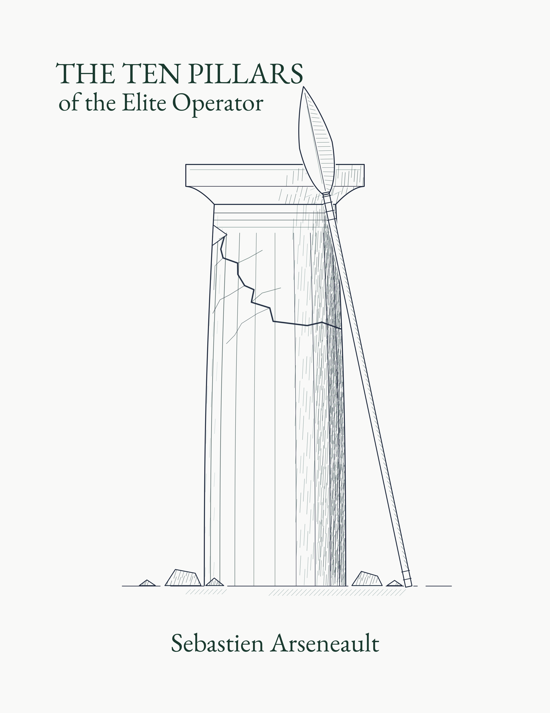

# The Ten Pillars of the Elite Operator

*The discipline that outlasts the technique.*

Every exploit gets patched. Every technique stops working. The tools you
learn this year are dead in a few. This is a short field manual on what
does not decay — the disciplines beneath technique that hold whether the
target is a web app or a hardened nation-state system.

These are not techniques. They are the habits that separate the operator
who lasts from the operator who gets caught. Each one is a decision made
in the calm, held ready against the single force that undoes operations:
the pressure to act before you have thought.

---

## The Ten

**I. Access** — The objective is reaching a place you should not, and holding it once you have. The exploit is only one way in, and rarely the best. Measure yourself by the access you gained, not by how impressive the tool was that gained it.

**II. Certainty** — Success is not whether you won. It is whether you know what you or your tool did. A clean "no" is a win. A murky "yes" is a liability.

**III. Protection** — A capability that is used can be seen; a capability that is seen is studied; a capability that is studied is dead. The tool that stays silent is worth years. Protect the means over the prize.

**IV. Patience** — The probe that finds the door is often the probe that closes it. Learn without touching. The one interaction that matters must be the one that succeeds.

**V. Restraint** — More is the instinct that gets you caught. Every foothold is a thing that can be found. The small footprint is not modesty. It is survival.

**VI. Memory** — To fail once is a cost. To fail twice the same way is a choice. Record every outcome, the wins beside the losses, and turn recurring failure into a rule that makes the mistake impossible.

**VII. Separation** — Never build while you operate, and let no single loss cost you everything. Freeze your work before you begin. Assemble from pieces that mean nothing alone.

**VIII. Provenance** — Your configuration is code. Every change recorded, attributed, reversible. When something fails, you trace it to the cause instead of guessing at it.

**IX. Position** — Where you stand matters more than what you carry. The crude tool from commanding ground defeats the fine tool from weak ground. Position cannot be bought, only occupied. Find the ground that is yours.

**X. Invisibility** — The finest work leaves no mark. Meaningless in isolation, silent under inspection. Build for the moment of inspection, not the moment of use.

---

## Read the full manual

**[The Ten Pillars of the Elite Operator (PDF)](./THE-TEN-PILLARS.pdf)**

Each pillar is developed in full in the document above.

---

*Sebastien Arseneault · Deep Woods Security*

*Licensed under [CC BY 4.0](./LICENSE). Share it, quote it, build on it — with attribution.*
